# Profile Activity Tracker

A reusable, automatically updated GitHub profile activity card. Personal
accounts, introduction, about paragraph, repository exclusions, and accent color are all
configuration—nothing personal is embedded in the renderer. The included sample profile uses
placeholder demo content so public previews stay generic.

## Example

The preview below is generated from fictional profile details and fixed sample
statistics. It never reads or displays the configured user's activity.

<picture>
  <source
    media="(prefers-color-scheme: dark)"
    srcset="./docs/activity-example-dark.svg"
  />
  <source
    media="(prefers-color-scheme: light)"
    srcset="./docs/activity-example-light.svg"
  />
  
</picture>


## What it tracks

The card presents a compact view of activity visible on GitHub's public
contribution calendar:

- combined activity from the configured personal accounts;
- GitHub contributions for this week, month, year, and all time;
- active days for the same four calendar periods;
- a JSON summary containing the detected languages from eligible repositories.

It is generated as self-contained light and dark SVG files with a smooth
white and silver layered-glass panel, a left-aligned introduction, and a
word-spaced justified profile summary. Continuously drifting clipped highlights,
frosted texture, soft shadows, and inner edge lighting create depth, while
staggered zoom-and-settle entrances introduce the content and respect
reduced-motion preferences. There is no public server,
tracking script or analytics service, and the generated SVG has no runtime
dependency or external asset request.

## How it works

```text
Scheduled GitHub Action
        │
        ▼
GitHub GraphQL API
        │
        ▼
Calendar-period aggregation and repository exclusions
        │
        ▼
Pure, escaped SVG + transparent JSON summary
        │
        ▼
Commit only generated files that changed
```

The workflow runs every 30 minutes, can be launched manually, and
also runs when generator code or configuration changes. If GitHub's API is
unavailable, generation fails before replacing the last valid cards.

## Reuse this tracker

1. Fork the repository or create a new repository from it.
2. Edit `config/profile.json` with your introduction, profile summary, account
   names, exclusions, and accent color.
3. In **Settings → Actions → General → Workflow permissions**, allow read and
   write access so the workflow can commit generated cards.
4. Run **Update profile activity** once from the Actions tab.
5. Add the profile integration snippet below to your profile README.

## Recommended workflow

- Always run `git pull --rebase origin main` before you start editing.
- Avoid manually committing generated files unless you are intentionally
  updating the card output.
- If you run `npm run generate`, do it after pulling the latest remote changes.
- Commit source/config changes first, then push; the workflow will update
  generated files automatically when needed.

## Profile integration

Place this in the `README.md` of your `YOUR_USERNAME/YOUR_USERNAME` profile
repository and replace each `YOUR_USERNAME` placeholder:

```html
<picture>
  <source
    media="(prefers-color-scheme: dark)"
    srcset="https://raw.githubusercontent.com/YOUR_USERNAME/profile-activity-tracker/main/generated/activity-dark.svg"
  />
  <source
    media="(prefers-color-scheme: light)"
    srcset="https://raw.githubusercontent.com/YOUR_USERNAME/profile-activity-tracker/main/generated/activity-light.svg"
  />
  
</picture>
```

## Configuration

Edit [`config/profile.json`](./config/profile.json):

```json
{
  "username": "your-github-username",
  "introduction": "I build reliable software and thoughtful products.",
  "about": "I enjoy solving meaningful engineering problems. My goal is to keep learning and turn useful ideas into polished products.",
  "additionalUsernames": ["your-other-account"],
  "excludedRepositories": ["your-github-username"],
  "brand": {
    "accent": "#2f81f7"
  }
}
```

`username` is the primary profile, `introduction` is the left-aligned title
above the glass panel, and `about` is the automatically wrapped and
left-aligned paragraph below it. Full lines are justified by changing only the
spacing between words; glyph shapes are never stretched. Use an empty
`additionalUsernames` array for one account, or
add other accounts to the same honest combined view. Contribution totals are
summed, while active days are merged by calendar date, so using two accounts on
one day still counts as one active day. Only public data and anonymized private
contributions that each account has chosen to share are available.

Languages are ordered using the bytes reported by GitHub for eligible
repositories; this ordering is not a measure of proficiency. Add generated,
tutorial, archived, or otherwise unrepresentative repositories to
`excludedRepositories`.

Week means Monday through the current day in UTC. Month and year are calendar
periods. All-time contributions and active days are calculated by collecting
every contribution year returned by GitHub. Totals follow GitHub's public
contribution calendar and can include anonymized private activity when that
visibility option is enabled on the profile. Contributions can include commits,
issues, pull requests, reviews, and other activity recognized by GitHub.

## Local development

Node.js 22 or newer is required. Install the pinned dependencies before running
the generator:

```sh
npm ci
npm test
npm run generate:placeholder
GH_TOKEN=your_token npm run generate
```

`GH_TOKEN` is required only for live generation. The committed workflow uses
GitHub's short-lived built-in token.

## Security and reliability

- Official Actions are pinned to immutable commit SHAs.
- Workflow permissions are limited to `contents: write`.
- API values are escaped before SVG rendering.
- SVGs contain no scripts, external resources, or remote fonts.
- Generation uses temporary files and atomic replacement.
- Tests cover configuration, date windows, calculations, escaping, and themes.

See [SECURITY.md](./SECURITY.md) for the token and disclosure policy.

Language brand marks are provided by
[Simple Icons](https://github.com/simple-icons/simple-icons), distributed under
CC0. Individual marks may remain subject to their owners' trademark policies.

## License

[MIT](./LICENSE)
