# Profile Activity Tracker

A distinctive, automatically updated GitHub activity card for
[@thibault-delattre](https://github.com/thibault-delattre).

<picture>
  <source media="(prefers-color-scheme: dark)" srcset="./generated/activity-dark.svg">
  <source media="(prefers-color-scheme: light)" srcset="./generated/activity-light.svg">
  
</picture>

## What it tracks

The card describes the most recent 90 days of public GitHub work:

- contributions and active days;
- merged and opened pull requests;
- code reviews and repositories contributed to;
- momentum compared with the preceding 90-day period;
- weekly contribution signal;
- language footprint across owned, public, non-fork repositories.

It is generated as static light and dark SVG files. There is no public server,
tracking script, analytics service, or runtime dependency.

## How it works

```text
Scheduled GitHub Action
        │
        ▼
GitHub GraphQL API
        │
        ▼
Metric normalization and repository exclusions
        │
        ▼
Pure, escaped SVG + transparent JSON summary
        │
        ▼
Commit only generated files that changed
```

The workflow runs every two hours at minute 17, can be launched manually, and
also runs when generator code or configuration changes. If GitHub's API is
unavailable, generation fails before replacing the last valid cards.

## Profile integration

Place this in the `README.md` of the
[`thibault-delattre/thibault-delattre`](https://github.com/thibault-delattre/thibault-delattre)
profile repository:

```html
<picture>
  <source
    media="(prefers-color-scheme: dark)"
    srcset="https://raw.githubusercontent.com/thibault-delattre/profile-activity-tracker/main/generated/activity-dark.svg"
  />
  <source
    media="(prefers-color-scheme: light)"
    srcset="https://raw.githubusercontent.com/thibault-delattre/profile-activity-tracker/main/generated/activity-light.svg"
  />
  
</picture>
```

## Configuration

Edit [`config/profile.json`](./config/profile.json):

```json
{
  "username": "thibault-delattre",
  "displayName": "Thibault Delattre",
  "periodDays": 90,
  "maxLanguages": 3,
  "excludedRepositories": ["thibault-delattre"],
  "brand": {
    "label": "ENGINEERING PULSE",
    "accent": "#2f81f7"
  }
}
```

Language percentages represent bytes reported by GitHub for eligible
repositories; they are not a measure of proficiency. Add generated, tutorial,
archived, or otherwise unrepresentative repositories to
`excludedRepositories`.

## Local development

Node.js 22 or newer is required. There are no third-party packages to install.

```sh
npm test
npm run generate:placeholder
GH_TOKEN=your_token npm run generate
```

`GH_TOKEN` is required only for live generation. The committed workflow uses
GitHub's short-lived built-in token.

## Security and reliability

- Official Actions are pinned to immutable commit SHAs.
- Workflow permissions are limited to `contents: write`.
- API values are escaped before SVG rendering.
- SVGs contain no scripts, external resources, or remote fonts.
- Generation uses temporary files and atomic replacement.
- Tests cover configuration, date windows, calculations, escaping, and themes.

See [SECURITY.md](./SECURITY.md) for the token and disclosure policy.

## License

[MIT](./LICENSE)
